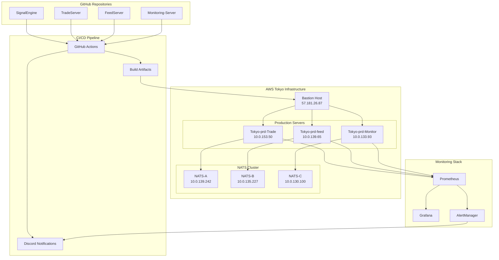
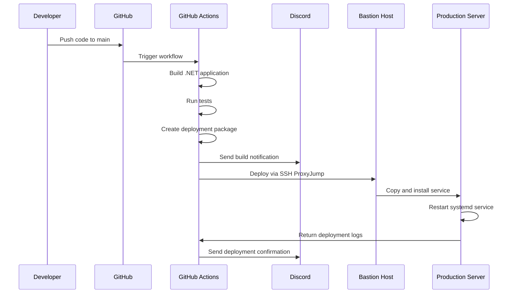

# XRP Trading System - Complete Architecture

## 🏗️ **System Overview**

High-frequency, low-latency XRP trading system deployed on AWS Tokyo infrastructure with complete CI/CD automation and Discord integration.

## 📊 **Component Architecture**



## 🔧 **Service Deployment Matrix**

| Server | Services | Purpose | Monitoring Port |
|--------|----------|---------|-----------------|
| **Tokyo-prd-Trade** (10.0.153.50) | SignalEngine + TradeServer | Core trading logic and execution | 8080, 8081 |
| **Tokyo-prd-feed** (10.0.139.65) | FeedServer | Market data ingestion and processing | 8082 |
| **Tokyo-prd-Monitor** (10.0.133.93) | Monitoring-Server | System health and alerting | 8083 |
| **NATS Cluster** | Message routing | Inter-service communication | 4222, 7777 |

## 🚀 **CI/CD Pipeline Flow**



## 🔐 **Security Architecture**

### **Access Control**
- All production access via bastion host (57.181.26.87)
- SSH key-based authentication only
- No direct internet access to production servers
- Encrypted secrets in GitHub Actions

### **Network Topology**
```
Internet → Bastion Host → Production Servers
         ↓
    GitHub Actions (via SSH ProxyJump)
```

## 📱 **Discord Integration Architecture**

### **Current Notifications**
- ✅ Build status (success/failure)
- ✅ Build duration and commit info
- ✅ Links to GitHub Actions logs

### **Enhanced Notifications (Next Phase)**
```json
{
  "deployment_notifications": {
    "service_restart": "🔄 Service {service} restarted on {server}",
    "deployment_success": "✅ {service} deployed successfully to {server}",
    "deployment_failure": "❌ Deployment failed for {service} on {server}",
    "health_check": "💚 All services healthy on {server}"
  },
  "trading_notifications": {
    "trade_executed": "💰 Trade executed: {amount} XRP at {price}",
    "signal_generated": "📊 Trading signal: {signal} for {pair}",
    "risk_alert": "⚠️ Risk threshold exceeded: {details}"
  },
  "system_alerts": {
    "high_latency": "🐌 High latency detected: {latency}ms",
    "connection_lost": "🔌 Exchange connection lost: {exchange}",
    "service_down": "🚨 Service down: {service} on {server}"
  }
}
```

## ⚡ **Performance Specifications**

### **Latency Requirements**
- **Order execution**: < 1ms
- **Signal processing**: < 100μs
- **Market data ingestion**: < 50μs
- **Inter-service communication**: < 10μs

### **Throughput Targets**
- **Orders per second**: 10,000+
- **Market data messages**: 100,000+/sec
- **Signal calculations**: 1,000+/sec

### **Optimization Strategies**
- Native .NET 8.0 compilation (no containers)
- Vertical scaling with large EC2 instances
- NATS for ultra-low latency messaging
- Memory-mapped files for state persistence
- Lock-free data structures

## 🔍 **Monitoring & Observability**

### **Metrics Collection**
```yaml
Application Metrics:
  - Trading latency (p50, p95, p99)
  - Order execution rate
  - Signal generation frequency
  - Error rates and exceptions

System Metrics:
  - CPU usage per core
  - Memory allocation patterns
  - Network I/O and latency
  - Disk I/O patterns

Business Metrics:
  - PnL tracking
  - Risk exposure
  - Market exposure
  - Trading volume
```

### **Alerting Thresholds**
```yaml
Critical Alerts:
  - Service down: 0s tolerance
  - High latency: >10ms sustained
  - Memory leak: >90% usage
  - Disk full: >95% usage

Warning Alerts:
  - Elevated latency: >5ms
  - High CPU: >80% sustained
  - Network issues: >1% packet loss
  - Build failures: Any failure
```

## 🗄️ **Data Architecture**

### **Message Flow**
```
Market Data → FeedServer → NATS → SignalEngine → TradeServer → Exchange
                    ↓
              Monitoring-Server (logging, metrics, alerts)
```

### **State Management**
- **In-memory**: Active positions, orders, signals
- **Persistent**: Trade history, configuration, logs
- **Backup**: S3 for long-term storage and compliance

## 🚀 **Deployment Strategy**

### **Blue-Green Deployment**
1. Deploy to staging slot
2. Run health checks
3. Switch traffic atomically
4. Keep previous version for rollback

### **Rollback Procedure**
```bash
# Automatic backup on each deployment
sudo systemctl stop {service}
sudo mv current failed-$(date +%Y%m%d-%H%M%S)
sudo mv backup-{timestamp} current
sudo systemctl start {service}
```

## 📋 **Production Readiness Checklist**

### **Infrastructure** ✅
- [x] All servers provisioned and configured
- [x] Network security groups configured
- [x] SSH access via bastion host working
- [x] NATS cluster operational

### **CI/CD Pipeline** ✅
- [x] GitHub Actions workflows configured
- [x] All secrets properly set
- [x] Build process working
- [x] Discord notifications active

### **Monitoring** 🔄
- [ ] Prometheus configuration deployed
- [ ] Grafana dashboards imported
- [ ] Alert routing configured
- [ ] Log aggregation setup

### **Testing** 🔄
- [ ] End-to-end deployment test
- [ ] Service health validation
- [ ] Performance benchmarking
- [ ] Failover testing

### **Go-Live** 🎯
- [ ] Production deployment enabled
- [ ] Real-time monitoring active
- [ ] Trading algorithms activated
- [ ] Risk management validated

---

**This architecture supports high-frequency trading with sub-millisecond latency requirements while maintaining operational excellence through comprehensive monitoring and automated deployment.**
